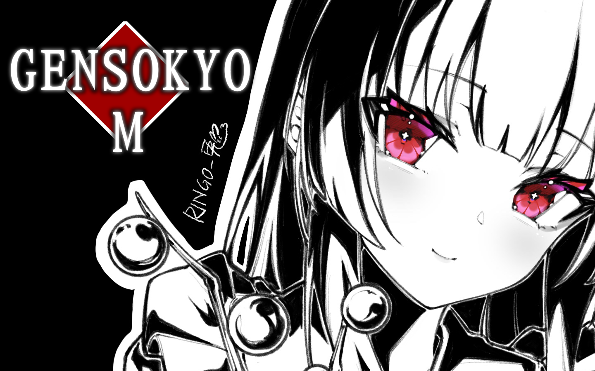
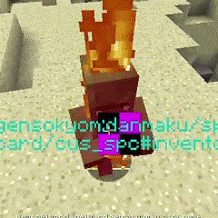

  
  <h1 align="center" style="font-weight:bold">GensokyoM(WIP)</h1> 

  
  
  

### Intro

Gensokyo in Memory,a mod for Minecraft **(NOT READY TO USE NOW)**

### How to use

 1. Install **Minecraft** and **Forge(>=1.12.2-2847)**
 2. Download the latest version of **mirror(>=0.5.0)** & **DanmakuCore(>=0.8)**
 3. Download this mod from the repo
 4. Put them on **mods** directory
 5. Launch Game and Enjoy

### GIFS

details

### Discussion

 - QQ: https://jq.qq.com/?_wv=1027&k=nNyXQBnv

### Credits

##### In **no particular** order

#### 上海アリス幻樂団 / Zun : Made the Touhou Project

#### Code

##### I refered to these repos when developing,thanks a lot

details

##### DanmakuCore

https://github.com/TeamNightclipse/DanmakuCore

##### Grimoire-Of-Alice

https://github.com/TeamNightclipse/Grimoire-Of-Alice

##### Avaritia

https://github.com/Morpheus1101/Avaritia/tree/1.12.2

#### Assets

##### I adapt some assets from them,all of them should remain original LICENSE

details

##### BG2
 
Artist: https://www.pixiv.net/users/56529134/artworks

Illust: https://www.pixiv.net/artworks/104833889

